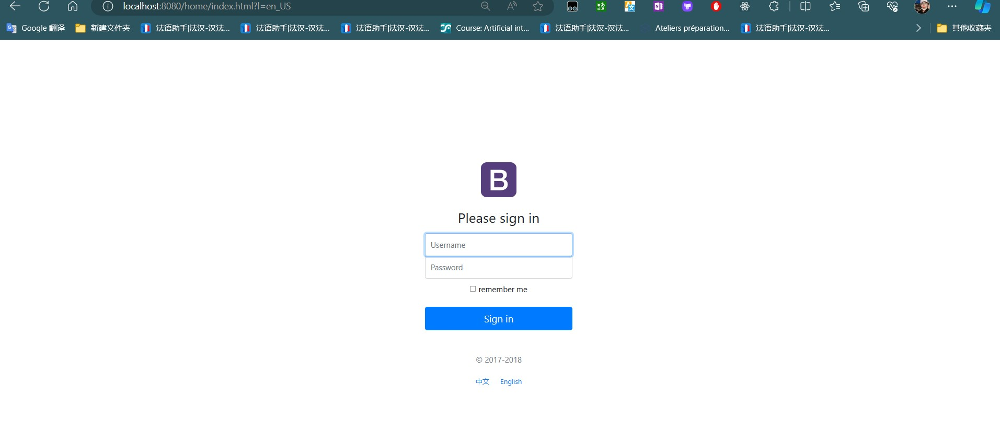
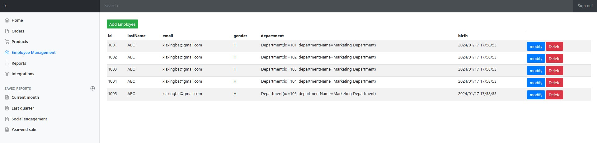

# Système de gestion des employés

## Description

Système de gestion des employés （complété une partie de la fonctionnalité --- principalement pour pratiquer Springboot, afin d'écrire rapidement le projet Springboot, donc ici d'omettre une partie de la structure hiérarchique, et de falsifier la base de données. (Si vous voulez voir un exemple incorporant Mybatis, veuillez visiter https://github.com/XIAxuanzheFrancis/springboot-mybatis) 

## Technologie

- SpringBoot
- thymeleaf(https://www.thymeleaf.org/documentation.html)(Se référer au modèle frontal ici pour écrire thymeleaf: https://getbootstrap.com/docs/4.0/examples/)

## Fonctions de mise en œuvre

1. Réalisation de la page d'accueil
2. internalisation
3. connexion
4. Login Interceptor
5. Afficher la liste du personnel
6. CRUD et traitement 404

## Affichage d'une page à deux fonctions

login je n'ai pas considéré la base de données à ce moment-là, voici Login arbitraire, le mot de passe est 123456

Les autres fonctions de l'onglet ne sont pas implémentées